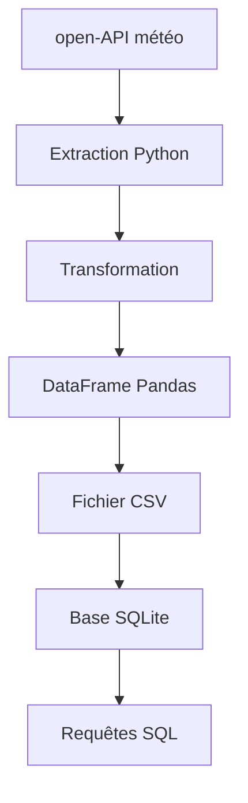

# Projet de pipeline de données météo

## description

Ce projet a pour objectif de créer unn pipeline de données permettant : 

- l'extraction de données météorologiques depuis une API
- la transformation des données JSON
- le stockage dans un DataFrame Pandas
- la sauvegarde dans un fichier CSV
- le stockage dans une base SQLite
- l'interrogation des données avec SQL

## Technologies utilisées

- Python
- Requests
- Pandas
- SQLite

## Architecture

## Auteur 

Cheikh Dahir FAYE

