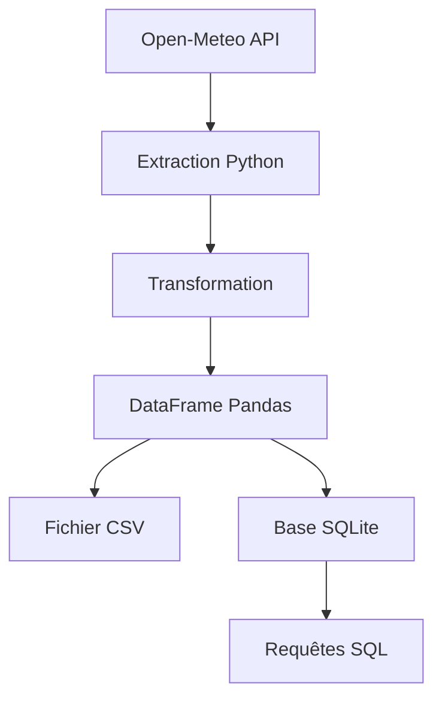

# Weather Data Pipeline Project

## description

Ce projet a pour objectif de créer un pipeline de données permettant : 

- l'extraction de données météorologiques depuis une API
- la transformation des données JSON
- le stockage dans un DataFrame Pandas
- la sauvegarde dans un fichier CSV
- le stockage dans une base SQLite
- l'interrogation des données avec SQL

## Technologies 

- Python
- Requests
- Pandas
- SQLite

### Planned technologies

- Docker
- Apache Airflow
- Power BI

## Architecture



## SQL queries

### Hottest city
```sql
SELECT city, temperature 
FROM weather 
ORDER BY temperature DESC
LIMIT 1;
```
Result : 
```text
Marseille | 20.9°C
```


### Average temperature
```sql
SELECT AVG(temperature) AS average_temperature
FROM weather;
```
Result : 
```text
20.0°C
```

### Ranking of cities by temperature
```sql
SELECT city, temperature
FROM weather
ORDER BY temperature DESC;
```
Result:
```text
Marseille | 20.9°C
Lyon      | 20.3°C
Toulouse  | 20.1°C
Paris     | 18.7°C
```

## Historical Data Exemple

|  city | collection_date | temperature |
|-------|-----------------|-------------|
| Lyon  |   2026-06-09    |    19.8°C   |
| Lyon  |   2026-06-10    |    19.8°C   |
| Paris |   2026-06-09    |    17.6°C   |
| Paris |   2026-06-10    |    17.6°C   |

*Les dates ont été simulées afin de démontrer le mécanisme d'historisation des données.*

## Future improvements

- Automatisation de la collecte quotidienne
- Conteneurisation avec Docker
- Orchestration avec Apache Airflow 
- Création d'un tableau de bord de visualisation

## Installation 

1. Ouvrir le notebook dans Google Colab
2. Installer les dépendances nécessaires :
   ```python
   pip install pandas requests
   ```
3. Exécuter les cellules dans l'ordre
4. Les données sont extraites depuis l'API Open-Meteo puis stockées dans SQLite

## Author

Cheikh Dahir FAYE

