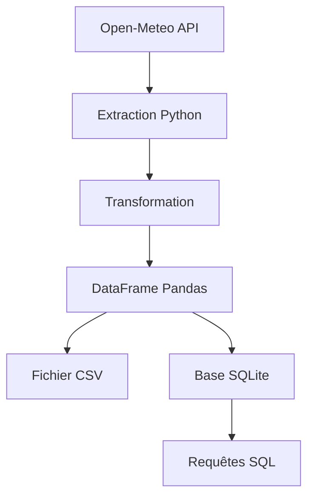

# Projet de pipeline de données météo

## description

Ce projet a pour objectif de créer un pipeline de données permettant : 

- l'extraction de données météorologiques depuis une API
- la transformation des données JSON
- le stockage dans un DataFrame Pandas
- la sauvegarde dans un fichier CSV
- le stockage dans une base SQLite
- l'interrogation des données avec SQL

## Technologies utilisées

- Python
- Requests
- Pandas
- SQLite

## Architecture



## SQL queries

### Hottest city
```sql
SELECT city, temperature 
FROM weather 
ORDER BY temperature DESC
LIMIT 1;
```
Résultat : 
```text
Marseille | 20.9°C
```


### Average temperature
```sql
SELECT AVG(temperature) AS average_temperature
FROM weather;
```
Résultat : 
```text
20.0°C
```

## Auteur 

Cheikh Dahir FAYE

